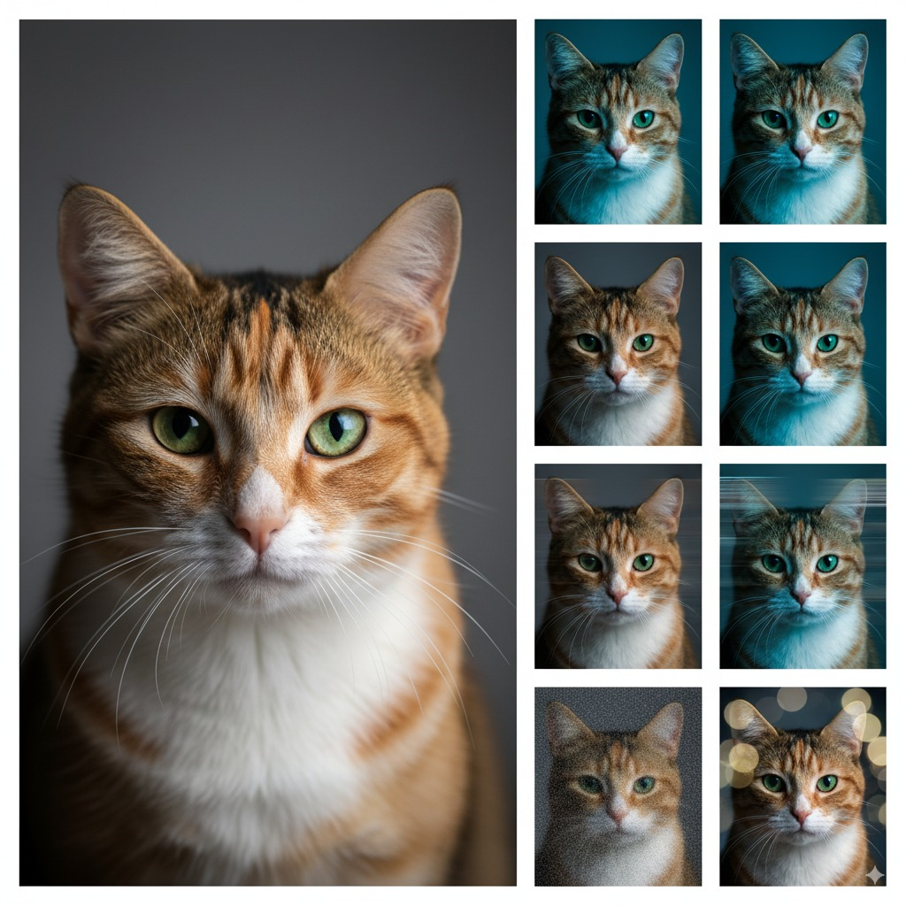

# Albumentations-MCP with Nano Banana (Gemini)


Natural language image augmentation via MCP protocol. Transform images using plain English with this MCP-compliant server built on [Albumentations](https://albumentations.ai/).

**Example:** `"add blur and rotate 15 degrees"` → Applies GaussianBlur + Rotate transforms automatically




## Quick Start

```bash
# Install from PyPI
pip install albumentations-mcp

# Run as MCP server
uvx albumentations-mcp
```

## MCP Client Setup

### Claude Desktop

Copy [claude-desktop-config.json](docs/claude-desktop-config.json) to `~/.claude_desktop_config.json`

Or add manually:

```json
{
  "mcpServers": {
    "albumentations": {
      "command": "uvx",
      "args": ["albumentations-mcp"],
      "env": {
        "MCP_LOG_LEVEL": "INFO",
        "OUTPUT_DIR": "./outputs",
        "ENABLE_VISION_VERIFICATION": "true",
        "DEFAULT_SEED": "42"
      }
    }
  }
}
```

### Kiro IDE

Copy [kiro-mcp-config.json](docs/kiro-mcp-config.json) to `.kiro/settings/mcp.json`

Or add manually:

```json
{
  "mcpServers": {
    "albumentations": {
      "command": "uvx",
      "args": ["albumentations-mcp"],
      "env": {
        "MCP_LOG_LEVEL": "INFO",
        "OUTPUT_DIR": "./outputs",
        "ENABLE_VISION_VERIFICATION": "true",
        "DEFAULT_SEED": "42"
      },
      "disabled": false,
      "autoApprove": ["augment_image", "list_available_transforms"]
    }
  }
}
```

## Available Tools

### Core MCP Tools
- **`ping`** - Lightweight health check that reports status, version, and timestamp.
- **`load_image_for_processing`** - Stage remote URLs or base64 payloads and return a `session_id` for follow-up calls.
- **`augment_image`** - Run Albumentations pipelines from natural language prompts or named presets.
- **`validate_prompt`** - Parse prompts and surface the structured transforms without processing images.
- **`list_available_transforms`** - Enumerate supported transforms with parameter metadata.
- **`list_available_presets`** - List built-in presets (`segmentation`, `portrait`, `lowlight`).
- **`get_quick_transform_reference`** - Provide a condensed keyword-to-transform reference for prompting.
- **`set_default_seed`** - Persist a global seed to keep augmentations reproducible.
- **`get_pipeline_status`** - Report pipeline configuration, enabled features, and output locations.
- **`get_getting_started_guide`** - Deliver the structured onboarding walkthrough as a tool response.

### VLM (Gemini / Nano Banana) Tools
- **`check_vlm_config`** - Verify VLM readiness without exposing secrets.
- **`vlm_test_prompt`** - Low-level text-to-image preview helper (no session required).
- **`vlm_generate_preview`** - Convenience wrapper for quick prompt/style ideation previews.
- **`vlm_apply`** - Direct VLM apply endpoint for image-to-image edits with fine-grained controls.
- **`vlm_edit_image`** - Full session edit flow that includes verification steps.
- **`vlm_suggest_recipe`** - Generate Albumentations + VLM plans and optionally save under `outputs/recipes/`.

Install (with or without VLM)

- Core only (Alb augmentations): `pip install albumentations-mcp`
- With VLM (Gemini): `pip install 'albumentations-mcp[vlm]'`
- Local dev (with VLM): `uv pip install -e '.[vlm]'`

Claude/uvx note: include the extra in args when you need VLM

- Latest prerelease with VLM: `"args": ["--refresh", "--prerelease=allow", "albumentations-mcp[vlm]"]`
- Pin stable with VLM: `"args": ["--refresh", "albumentations-mcp[vlm]==1.0.2"]`

VLM quickstart (env or file):

```bash
# Option 1: env
set ENABLE_VLM=true
set VLM_PROVIDER=google
set VLM_MODEL=gemini-2.5-flash-image-preview
set GOOGLE_API_KEY=...  # or GEMINI_API_KEY / VLM_API_KEY

# Option 2: file (auto-discovered)
# Place a non-secret file at config/vlm.json:
{
  "enabled": true,
  "provider": "google",
  "model": "gemini-2.5-flash-image-preview"
  // api_key may be in file or environment
}
```

Examples:

```python
# Preview (no input image, no session)
vlm_generate_preview(prompt="Neon night street, cinematic moodboard")

# Edit (image + prompt, full session)
vlm_edit_image(
    image_path="examples/basic_images/cat.jpg",
    prompt=(
        "Using the provided photo of a cat, add a small, knitted wizard hat. "
        "Preserve identity, pose, lighting, and composition."
    ),
    edit_type="edit",
)

# Plan and save a hybrid recipe (Alb + VLMEdit)
plan = vlm_suggest_recipe(
    task="domain_shift",
    constraints_json='{"output_count":3,"identity_preserve":true}',
    save=True,
)
print(plan["paths"])  # outputs/recipes/<timestamp>_<task>_<hash>/
```

MCP env examples for VLM (choose one option)

Option A - file (preferred):

```json
{
  "mcpServers": {
    "albumentations": {
      "command": "uvx",
      "args": ["albumentations-mcp"],
      "env": {
        "MCP_LOG_LEVEL": "INFO",
        "OUTPUT_DIR": "./outputs",
        "ENABLE_VLM": "true",
        "VLM_CONFIG_PATH": "config/vlm.json"
      }
    }
  }
}
```

Option B - inline env (no file):

```json
{
  "mcpServers": {
    "albumentations": {
      "command": "uvx",
      "args": ["albumentations-mcp"],
      "env": {
        "MCP_LOG_LEVEL": "INFO",
        "OUTPUT_DIR": "./outputs",
        "ENABLE_VLM": "true",
        "VLM_PROVIDER": "google",
        "VLM_MODEL": "gemini-2.5-flash-image-preview"
      }
    }
  }
}
```

## Available Prompts

### Core Prompt Templates
- **`compose_preset`** - Generate augmentation policies from presets with optional tweaks
- **`explain_effects`** - Analyze pipeline effects in plain English
- **`augmentation_parser`** - Parse natural language to structured transforms
- **`vision_verification`** - Compare original and augmented images
- **`error_handler`** - Generate user-friendly error messages and recovery suggestions

### VLM Prompt Templates
- None (VLM flows currently reuse the core prompt templates.)

## Available Resources

### Core MCP Resources
- **`transforms_guide`** - Comprehensive transform documentation with defaults and parameter ranges.
- **`policy_presets`** - Built-in preset configurations for segmentation, portrait, and lowlight workflows.
- **`available_transforms_examples`** - Practical usage examples organized by transform category.
- **`preset_pipelines_best_practices`** - Guidance for composing and maintaining augmentation pipelines.
- **`troubleshooting_common_issues`** - Frequently seen problems with recommended fixes.
- **`get_getting_started_guide`** - Structured onboarding guide; identical content to the tool response.

### VLM Resources
- **`get_gemini_prompt_templates`** - JSON templates and style guidance for Gemini-based VLM flows.


## Usage Examples

```python
# Simple augmentation
augment_image(
    image_path="photo.jpg",
    prompt="add blur and rotate 15 degrees"
)

# Using presets
augment_image(
    image_path="dataset/image.jpg",
    preset="segmentation"
)

# Test prompts
validate_prompt(prompt="increase brightness and add noise")

# Process from URL (two-step)
session = load_image_for_processing(image_source="https://example.com/image.jpg")
# Use the returned session_id from the previous call
augment_image(session_id="<session_id>", prompt="add blur and rotate 10 degrees")
```

## Features

- **Natural Language Processing** - Convert English descriptions to transforms
- **Preset Pipelines** - Pre-configured transforms for common use cases
- **Reproducible Results** - Seeding support for consistent outputs
- **MCP Protocol Compliant** - Full MCP implementation with tools, prompts, and resources
- **Comprehensive Documentation** - Built-in guides, examples, and troubleshooting resources
- **Production Ready** - Comprehensive testing, error handling, and structured logging
- **Multi-Source Input** - Works with local file paths, base64 payloads, and URLs (via loader)

## Documentation

- [Installation & Setup](docs/setup.md)
- [Architecture Overview](docs/architecture.md)
- [Purpose & Rationale](docs/purpose.md)
- [Preset Configurations](docs/presets.md)
- [Session Folders (outputs/) Guide](docs/session-folders.md)
- [Regex Security Analysis](docs/regex_security_analysis.md)
- [Design Philosophy](docs/design_philosophy.md)
- [Usage Examples](docs/examples.md)
- [VLM (Nano Banana/Gemini) Guide](docs/vlm_nano_banana.md)
- [Troubleshooting](docs/troubleshooting.md)
- [Contributing](docs/contributing.md)

### Configuration Files

- [Claude Desktop Config](docs/claude-desktop-config.json)
- [Kiro IDE Config](docs/kiro-mcp-config.json)
- [All Configuration Examples](docs/mcp-config-examples.json)
- [VLM Example Config](config/vlm.example.json)

## License

MIT License - see [LICENSE](LICENSE) for details.

**Contact:** [ramsi.kalia@gmail.com](mailto:ramsi.kalia@gmail.com)
